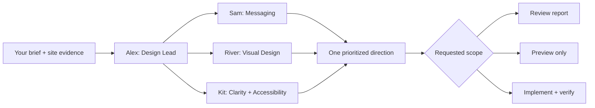

# AI Web Design Team

**Turn “make this website better” into a clear design direction, working changes, and checks that the important stuff still works.**

Meet **Alex, Sam, River, and Kit**: your AI web design team. Alex coordinates the work; Sam sharpens the words; River shapes the look; Kit checks that the site is clear and usable. Use the team to **review a website**, **redesign an existing site**, or **build from scratch**.

Setup guides cover **Codex, Claude Code, Cursor, GitHub Copilot, OpenClaw, and Hermes Agent**. The team is a set of Markdown instructions your coding agent follows with its available tools. No separate AI service, API key, or framework is required by this pack. Your agent subscription and website dependencies still apply.

[Get started](#get-started) · [Example prompts](docs/prompts.md) · [Setup by tool](docs/setup.md) · [Meet the team](#meet-the-team) · [Troubleshooting](docs/setup.md#troubleshooting)

**New to AI design?** A *skill* is a reusable guide for your AI assistant. You talk to Alex in one conversation, and Alex brings in the relevant specialties and gives you one clear result. Start with [your first session](docs/first-session.md); you don't need design vocabulary or experience managing agents.

## Get started

**Already using OpenClaw or Hermes?** Use their [native installation commands](docs/setup.md#openclaw); you don't need our Python installer. Hermes can install directly from GitHub without downloading this repository first.

### 1. Download the team

Use **Code → Download ZIP** on GitHub and extract it, or run:

```sh
git clone https://github.com/mrcoinzzz/ai-web-design-team.git
cd ai-web-design-team
```

### 2. Install in your website project

Run **one** command from the downloaded team folder. Replace `/path/to/your-website` with your website folder. For a new site, create an empty project folder first.

| Your tool | Installation command |
| --- | --- |
| Codex | `python3 scripts/install.py codex --project "/path/to/your-website"` |
| Claude Code | `python3 scripts/install.py claude --project "/path/to/your-website"` |
| Cursor | `python3 scripts/install.py cursor --project "/path/to/your-website"` |
| GitHub Copilot | `python3 scripts/install.py copilot --project "/path/to/your-website"` |

The installer needs Python 3.9+ and copies the complete skill into the tool's project folder. It refuses to overwrite an existing installation and does not change agent settings. Add `--dry-run` to see the destination first. On Windows, use `py -3` instead of `python3` and a Windows project path.

**No Python?** Copy the folder manually using the [setup guide](docs/setup.md). **Multiple tools?** Read the [shared installation guidance](docs/setup.md#using-more-than-one-tool) before making duplicate copies.

### 3. Open your website project and ask

For **Codex**:

```text
Use $ai-web-design-team. Alex, help me understand how to improve this
website. Review it with the team and explain the five most useful
changes in plain language. Don't edit anything yet.
```

For **Claude Code**:

```text
/ai-web-design-team Alex, help me understand how to improve this website.
Review it with the team and explain the five most useful changes in
plain language. Don't edit anything yet.
```

In **Cursor**, type `/` and select `ai-web-design-team`, then give the request. In **Copilot agent mode**, ask it to use the `ai-web-design-team` skill to review this website. [Tool setup and official sources](docs/setup.md).

In **OpenClaw or Hermes**, after the native installation, ask: “Use the ai-web-design-team skill. Alex, review this website with the team. Don't edit it yet.” Include the URL or project location accessible to that agent.

Give the agent a URL, an open website repository, or screenshots. Include the audience and main action if you know them. You don't need to fill out a questionnaire or manually manage reviewers.

## Choose the job

After invoking the skill, use one of these requests:

| Job | What to ask | What you get |
| --- | --- | --- |
| Review | “Review the homepage. Don't edit it.” | Prioritized findings with evidence and exact changes |
| Redesign | “Redesign and implement the homepage. Keep signup and forms working.” | A coherent direction, updated site, before/after evidence where available, and checks |
| Build | “Build a site for my tutoring business. The main action is booking a call.” | Page/flow plan, design direction, working requested pages, and verification |
| Preview only | “Show a redesign in a separate preview. Don't edit the app.” | A labeled concept; application files remain unchanged |

Add **“Use one agent”** to reduce usage, or **“Focus only on the pricing page”** to narrow the work. These are plain-language preferences, not configuration flags. See [ready-to-use prompts](docs/prompts.md) and the optional [brief template](docs/brief.md).

## Meet the team

| Team member | How they help | Hands back |
| --- | --- | --- |
| **Alex — Design Lead** | Keeps the work focused, combines advice, makes changes, and checks the result | One direction and a completed result |
| **Sam — Messaging & CTA** | Makes the offer clear and the next action easy to understand | Exact headlines, button/link labels, and copy changes |
| **River — Visual Design** | Makes layout, type, spacing, imagery, and brand work together | A concrete direction and reusable visual choices |
| **Kit — Clarity & Accessibility** | Checks that people can understand and use the site across relevant devices and interactions | Specific usability fixes and checks |

*CTA* means *call to action*: a button or link such as “Book a call” that invites the visitor to take the next step.

After selecting the skill, you can say **“River, review the homepage layout”**, **“Sam and Kit, review the signup page”**, or simply **“Alex, help me improve this site.”** Names and role descriptions both work. The names are friendly labels within this skill, not separate commands or persistent people; you don't install each member separately.

For substantial work, Alex requests independent specialist subagents—separate AI review tasks—when the host supports them. For a named subset, Alex uses only the requested specialties. For small tasks, limited tools, or a single-agent request, Alex applies the relevant review lenses directly and says so. The pack does not require persistent agents, a particular model, or Claude Code's separate Agent Teams feature.

Alex resolves disagreements and owns application edits. Reviewers don't edit the same files or hand you three competing reports.



## What good work looks like

- **Specific:** exact replacement copy and layout changes instead of “make it pop.”
- **Coherent:** a direction tailored to the audience and brand, carried across the requested pages.
- **Functional:** required routes, forms, CTA destinations, integrations, and analytics survive a redesign.
- **Evidence-based:** visual observations and interaction checks are distinguished. Conversion gains are hypotheses until measured.
- **Honest:** no invented testimonials, prices, customers, features, successful submissions, or test results.

An [illustrative review](docs/example-review.md) shows the expected detail. Review needs evidence; implementation needs an editable project; rendered verification needs browser tools. The team states gaps instead of pretending tools exist. Deployment follows your requested scope and permissions.

## Three essentials, handled by the team

For substantial work, the existing roles also make these explicit:

1. **A problem worth solving:** the visitor's task, evidence of friction, and what success would look like.
2. **A small reusable design system:** shared styles and components that keep the requested pages consistent.
3. **A complete journey:** relevant waiting, error, and recovery states, with actual checks distinguished from proposed user testing.

These fit into the normal brief and handoff. You still invoke one skill; small edits skip unnecessary tables and process. See [what we learned from Designer Skills](docs/design-essentials.md) for the comparison and source links.

## Customize or contribute

Start by telling the team your brand, preferred examples, and constraints. To change its workflow, edit the [skill](skills/ai-web-design-team/SKILL.md) or its [role playbooks](skills/ai-web-design-team/references/team.md). Installed copies do not update automatically; see [updating and removing](docs/setup.md#updating-and-removing).

Contributions should include a realistic request, the observed problem, and evidence that the change improves the result. [Contributor guide](CONTRIBUTING.md) · [Behavioral scenarios](evals/scenarios.md).

**Validation status:** installation and package checks are automated. Setup paths are based on official documentation. End-to-end behavior and real-site design quality still need evaluation in each host; documentation support is not a claim that every client was tested.

Our [next improvement priorities](docs/next-improvements.md) focus on real examples, easier setup diagnosis, and better design preference discovery.

Licensed under the [MIT License](LICENSE).
