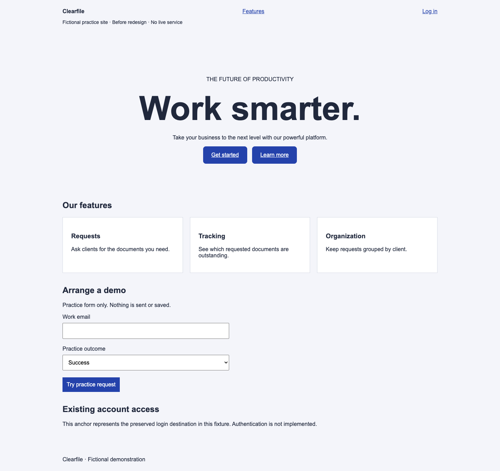
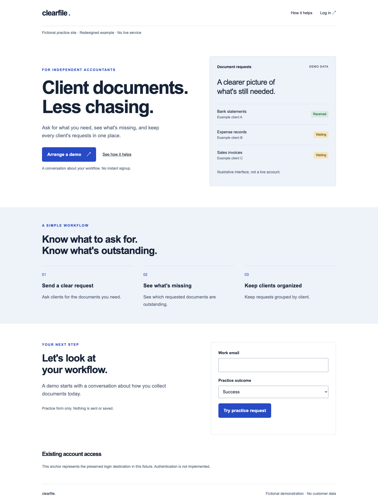
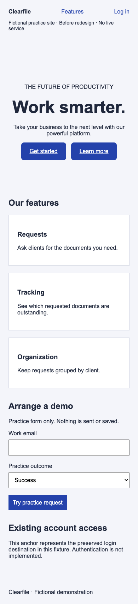
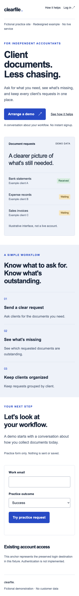

# Clearfile: an existing-site redesign

[All examples](../README.md)

**Fictional brief:** “Redesign this homepage for independent accountants. Help visitors understand document requests and arrange a demo. Keep the blue identity, feature content, demo destination, login destination, and practice form behavior. Use one agent and check desktop/mobile.”

The [before page](before.html) is an intentionally generic but functioning baseline. The [after page](after.html) implements the redesign. Both use the same [practice form handler](../demo.js); neither sends or stores data.

## Starting evidence and readiness

Alex could read and edit the fixtures, render them in a browser, and exercise local interactions. This example used one agent applying all three lenses; no independent specialist results are claimed. A real product backend, analytics, and customer research were unavailable and not invented.

The baseline headline “Work smarter” failed to explain the document task. Two equally styled hero links competed visually. The feature copy supplied the three capabilities we could truthfully bring into the hero: request documents, track outstanding requests, and group by client. The baseline primary link targeted `#request`; login targeted `#account`.

## Decisions through the three lenses

| Lens | Decision and reason |
| --- | --- |
| Sam — Messaging | “Client documents. Less chasing.” names the task. “Arrange a demo” matches the preserved destination; supporting copy avoids implying instant signup. |
| River — Visual Design | Keep blue, use one prominent action, create a strong reading hierarchy, and show a compact illustrative request list. Reuse color, type, spacing, and button rules from [site.css](../site.css). |
| Kit — Clarity & Accessibility | Keep visible login access, explicit labels, native email validation, focus styling, and clear practice-only feedback. Check failure and retry as well as success. |

Two small direction descriptions were considered: an editorial explanation with compact product evidence, and a denser product-led view. The editorial direction was selected for the comprehension problem. This was a design decision within the example, not a user preference study.

**Preference note retained:** explain the offering first; retain blue and account access; avoid gradients and competing filled buttons; stack the content for mobile; keep detailed product UI illustrative and labeled. The success criterion is understandable, accurate copy and preserved local behavior. More demo requests remains an unmeasured hypothesis.

## Before and after

| Before · desktop | After · desktop |
| --- | --- |
|  |  |

| Before · mobile | After · mobile |
| --- | --- |
|  |  |

## Behavior and limits

The [saved check results](../evidence/results.json) record both versions at both widths: destinations, keyboard focus, overflow, invalid input, pending state, failure/input retention, retry, and explicit simulated success. Open either page to try the practice form; choose “Error” and then “Success” to exercise recovery.

The login target is only a preserved anchor representing account access. Authentication and message delivery are not implemented. There is no claim that the new page converts better or passes a full accessibility audit. Human newcomer testing and a real production redesign remain future evaluation work.
