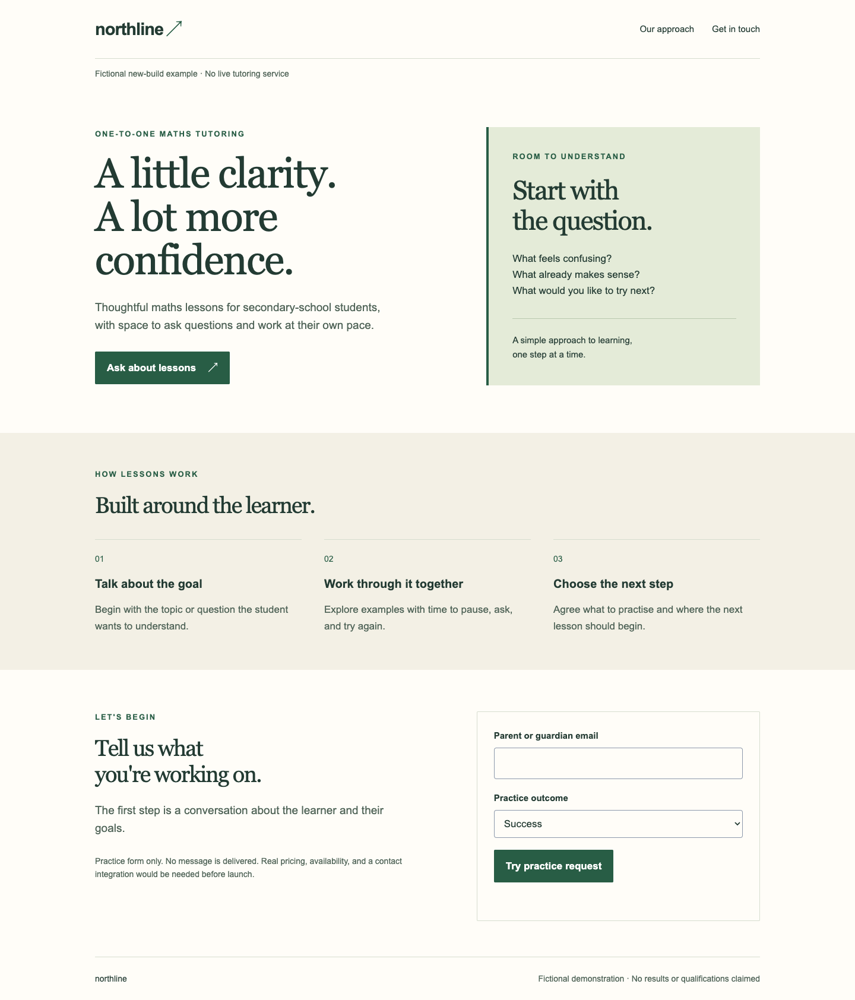
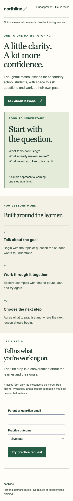

# Northline: a new site from a brief

[All examples](../README.md)

**Fictional brief:** “Build a simple one-page site for a maths tutor. Parents should understand the approach and ask about lessons. Make it calm and welcoming. No prices, qualifications, testimonials, or results have been supplied. Include a clearly labeled local practice form, not a real contact integration. Use one agent.”

The [completed page](index.html) can be opened locally without a build step. There is no before site to compare; this is a brief-to-implementation example.

## Readiness and decisions

Alex had editable local files and browser rendering/testing. Real service details, a backend, and user research were absent. The implementation is a fictional practice page, not a launch-ready tutoring business.

| Lens | Decision and reason |
| --- | --- |
| Sam — Messaging | Explain one-to-one maths tutoring and the next conversation; don't invent exam gains, endorsements, or pricing. |
| River — Visual Design | Choose editorial serif headings, forest-green actions, and a quiet reading sequence. Use a text-based lesson panel rather than an invented tutor photo. |
| Kit — Clarity & Accessibility | Link the primary action to the contact section, make form labels explicit, and retain input after a simulated failure so the visitor can retry. |

The established calm/welcoming brief was enough to choose one direction; two options were not necessary. The page sequence is offer → approach → contact. This single-page scope avoids inventing booking, payment, account, or availability systems.

**Preference note retained:** calm and readable; green identity; expressive serif headings with plain body type; no claims about outcomes; prominent contact action; one reading sequence on mobile. Shared visual rules are in [site.css](../site.css), with Northline-specific tokens and heading treatment.

## The result

| Desktop | Mobile |
| --- | --- |
|  |  |

## Checks and what remains

The [saved browser results](../evidence/results.json) cover both viewports, navigation, visible initial keyboard focus, no horizontal overflow, invalid email handling, pending feedback, error recovery, and explicitly simulated success. The [practice handler](../demo.js) makes no network request and stores no input.

Before a real launch, the business would need to supply verified facts, contact handling, and any applicable policies. Comprehension with actual parents, screen-reader usability, and conversion outcomes have not been tested. This is a reproducible worked example, not a claim that the skill autonomously delivered a live service.
